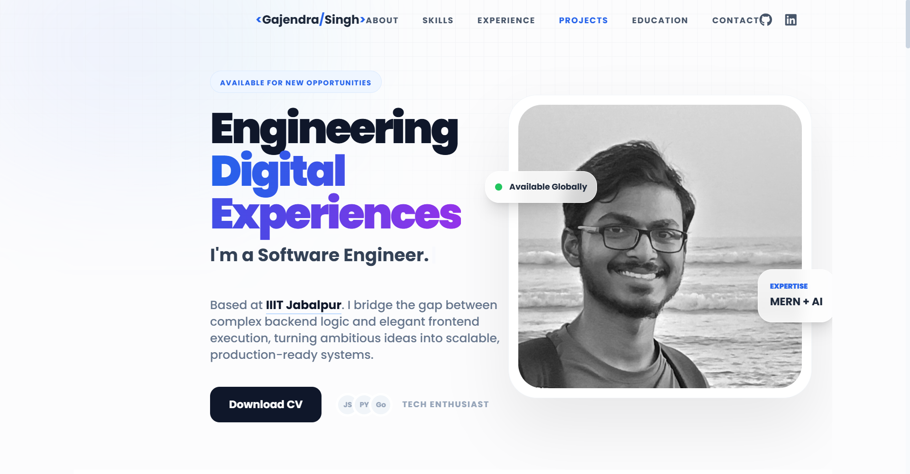

# 🚀 Modern Full-Stack Developer Portfolio

A high-performance, responsive portfolio built with the **MERN Stack** philosophy, featuring a clean **Glassmorphism UI**, smooth animations, and optimized asset delivery. This project serves as a comprehensive showcase of software engineering principles, UI/UX design, and scalable frontend architecture.
# Screenshot
<b>Dashboard & Navigation</b>




## 🛠️ Technical Stack

- **Frontend:** React.js (Hooks, Functional Components)
- **Styling:** Tailwind CSS (Modern Utility-first approach)
- **Animations:** Framer Motion & React-Parallax-Tilt
- **Icons:** React Icons (Lucide, FontAwesome)
- **Environment:** Vite (High-performance build tool)
- **Deployment:** Vercel / Netlify

## ✨ Key Features

- **Responsive Architecture:** Fully optimized for mobile, tablet, and desktop viewing.
- **Dynamic Component Design:** Clean, modular React components for high maintainability.
- **Glassmorphism UI:** A modern light-themed aesthetic featuring backdrop blurs and soft shadows.
- **Interactive Elements:** Smooth scrolling, parallax tilt effects, and typing animations for enhanced UX.
- **SEO Optimized:** Structured semantic HTML for better search engine ranking and accessibility.

## 🏗️ Architecture Overview

The project follows a modular directory structure to ensure separation of concerns:

```text
src/
├── assets/          # Static media assets (Images, Logos)
├── components/      # Reusable UI components (Navbar, Footer, BlurBlob)
├── sections/        # Main page sections (About, Work, Skills)
├── constants/       # Centralized data store for easy content updates
└── App.jsx          # Root component and layout wrapper

```

## 🚀 Getting Started

To get a local copy up and running, follow these steps:

1. **Clone the repository:**
```bash
git clone [https://github.com/gs27304/my-portfolio.git](https://github.com/gs27304/my-portfolio.git)

```


2. **Install dependencies:**
```bash
npm install

```


3. **Run the development server:**
```bash
npm run dev

```


## 📈 Optimization & Performance

* **Asset Compression:** Optimized images for fast initial load times.
* **Lazy Loading:** Implemented component-based rendering strategies.
* **Tree Shaking:** Minimized bundle size by utilizing Vite's build optimization.

## 👤 Author

**Gajendra Singh**

* **GitHub:** [@gs27304](https://github.com/gs27304)
* **LinkedIn:** [Gajendra Singh](https://www.linkedin.com/in/gajendra-singh-006a11219/)

---

*Built with ❤️ and passion for clean code.*

```


**Would you like me to help you set up the deployment to Vercel so you can add the live link to this README?**

```
